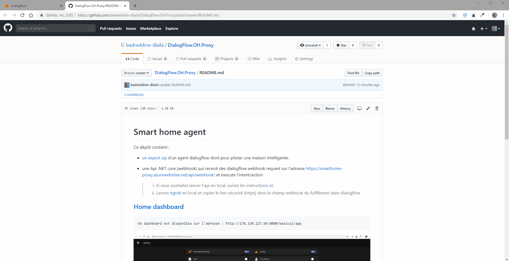
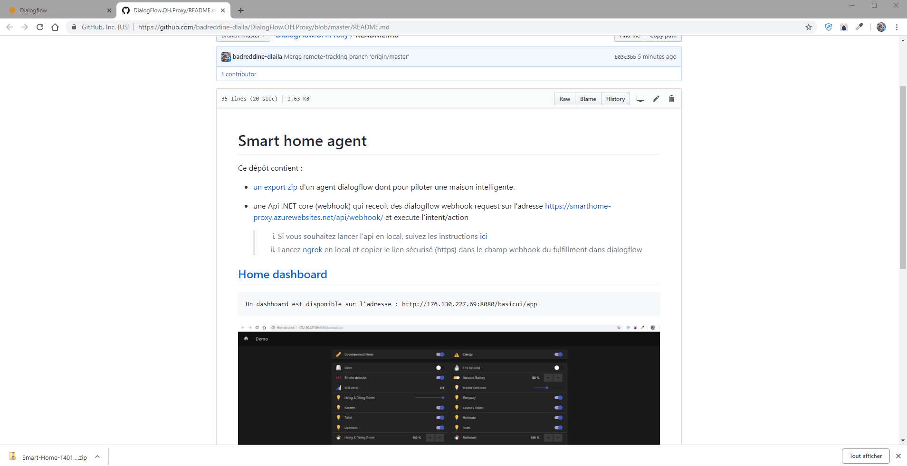
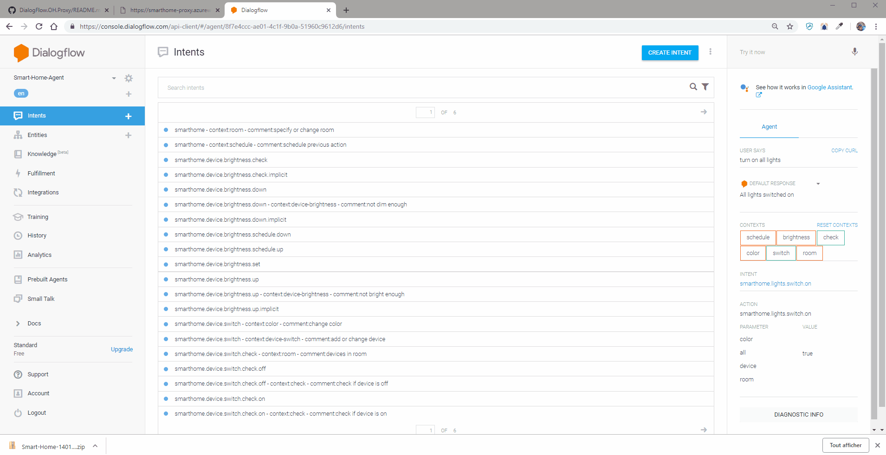
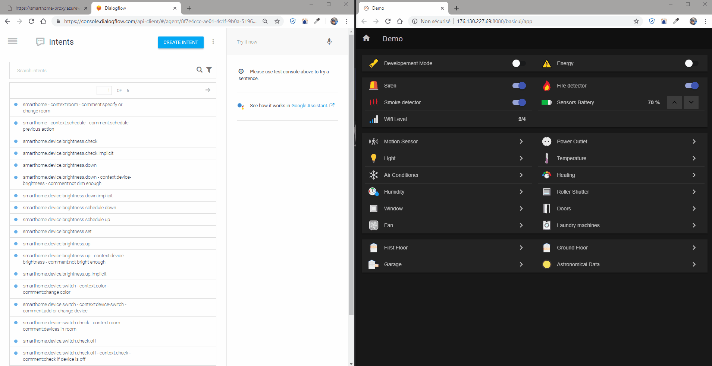

# Smart home agent

This repository contains the following main elements :

- [zip export](https://github.com/badreddine-dlaila/DialogFlow.OH.Proxy/raw/master/Smart-Home-14012019.zip) A dialog flow agent that command a smart connected home

- A .NET Core Api (webhook) taht recieves dialogflow fulfillment requests https://smarthome-proxy.azurewebsites.net/api/webhook/ and execute the matching intent/action

### <!> Important <!>

pour éviter les surprise, référez-vous à l'agent example inclus dans ce dépôt ([Smart-Home-14012019.zip](https://github.com/badreddine-dlaila/DialogFlow.OH.Proxy/raw/master/Smart-Home-14012019.zip))

Le [proxy](https://smarthome-proxy.azurewebsites.net/api/info) peut interpréter
1. les intents suivants ( Où * est le prefixe de votre projet. Dans l'exemple Smart-Home, * est remplacé par smarthome, pour donner par exemple *smarthome.device.switch.off* )
    - *.device.switch.off
    - *.device.switch.on
    - *.lights.switch.off
    - *.lights.switch.on
    - *.lights.brightness.set
    - *.heating.set
 2. les action suivantes ( Où * peut etre par example le nom de l'intent, Dans l'exemple Smart-Home, * est remplacé par smarthome, pour donner par exemple *smarthome.device.switch.off* ):
    - *.off
    - *.on
    - *.set

## [Home dashboard](http://176.130.227.69:8080/basicui/app)
    smart home dashboard : http://176.130.227.69:8080/basicui/app

## Restore Agent

## Set webhook

## Enable webhook

## Executing intents on dashboard (real time)

    
 

