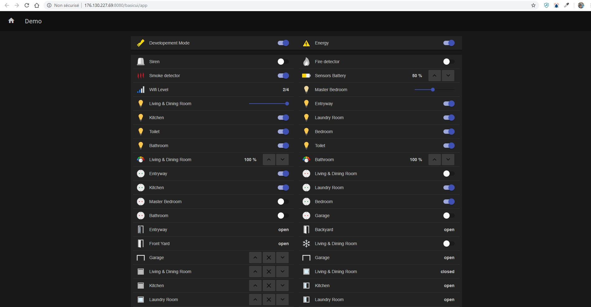

# Smart home agent

Ce depot contient :

- [un export zip](https://github.com/badreddine-dlaila/DialogFlow.OH.Proxy/raw/master/Smart-Home-14012019.zip) d'un agent dialogflow dont pour piloter une maison intelligente.

- une Api .NET core (webhook) qui receoit des dialogflow webhook request sur l'adresse https://smarthome-proxy.azurewebsites.net/api/webhook/ et execute l'intent/action 

## [Home dashboard](http://176.130.227.69:8080/basicui/app)
    Un dashboard est disponible sur l'adresse : http://176.130.227.69:8080/basicui/app

